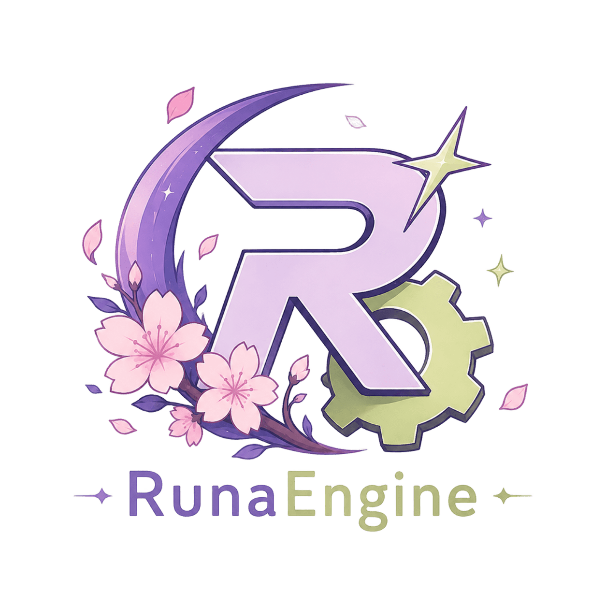

<div align="center">
  

  # RunaEngine

  **Game engine 2D ringan berbasis Rust, `wgpu`, dan `winit`.**

  Dibangun dari dasar untuk mempelajari arsitektur game engine modern, rendering GPU,
  dan game loop yang deterministik.

  
  
  
  
</div>

---

## Tentang RunaEngine

RunaEngine adalah proyek game engine 2D eksperimental yang ditulis dengan Rust. Fokusnya adalah menyediakan fondasi yang sederhana dan mudah dipahami untuk membangun game 2D: mulai dari window dan game loop, pengelolaan waktu, hingga pipeline rendering sprite yang berjalan langsung di GPU.

Proyek ini masih dalam tahap pengembangan awal. API dapat berubah seiring bertambahnya sistem dan penyempurnaan arsitektur engine.

## Fitur Saat Ini

- **Rendering GPU modern** menggunakan `wgpu`.
- **Window dan event loop lintas platform** menggunakan `winit`.
- **Game loop 60 FPS** dengan pembatasan frame bawaan.
- **Fixed timestep** untuk logika game yang konsisten dan deterministik.
- **Variable timestep** untuk pembaruan per frame.
- **Renderer sprite 2D** dengan posisi, rotasi, dan skala.
- **Sprite instancing** untuk mengirim banyak sprite ke GPU secara efisien.
- **Kamera ortografis 2D** dengan koordinat berbasis piksel.
- **Texture manager** berbasis handle untuk memuat dan menggunakan aset gambar.
- **Alpha blending** untuk tekstur dengan transparansi.
- **Statistik runtime** berupa FPS, delta time, dan frame count.

## Teknologi

| Komponen | Teknologi | Peran |
| --- | --- | --- |
| Bahasa | Rust 2024 | Fondasi engine yang aman dan berperforma tinggi |
| Rendering | `wgpu` | Abstraksi GPU modern lintas platform |
| Windowing | `winit` | Window, event loop, dan event sistem operasi |
| Tekstur | `image` | Decode aset gambar |
| Data GPU | `bytemuck` | Konversi data vertex dan uniform secara aman |
| Async bootstrap | `pollster` | Menjalankan inisialisasi renderer asynchronous |

## Memulai

### Prasyarat

Pastikan perangkat memiliki:

- Rust stable yang mendukung **edition 2024**.
- Driver GPU terbaru dengan backend grafis yang didukung `wgpu`.
- Git untuk mengambil source code.

### Menjalankan Engine

```bash
git clone https://github.com/rillToMe/RunaEngine.git
cd runa_engine
cargo run
```

Saat dijalankan, RunaEngine membuka window berukuran `1280x720`, memuat tekstur bawaan, dan merender beberapa sprite dengan transformasi berbeda.

Untuk memastikan proyek dapat dikompilasi tanpa menjalankan window:

```bash
cargo check
```

## Membuat Game

Game di RunaEngine mengimplementasikan trait `Game`, lalu diberikan kepada `App` sebagai state utama aplikasi.

```rust
use engine::{App, Game};

struct MyGame {
    position: f32,
    velocity: f32,
}

impl Game for MyGame {
    fn fixed_update(&mut self, dt: f32) {
        self.position += self.velocity * dt;
    }

    fn update(&mut self, _dt: f32) {
        // Logika yang diperbarui setiap frame.
    }

    fn render(&mut self) {
        // Renderer saat ini dikelola oleh App.
    }
}

fn main() {
    let game = MyGame {
        position: 0.0,
        velocity: 100.0,
    };

    App::new("RunaEngine", 1280, 720, game).run();
}
```

### Siklus Frame

```text
Window Event
    |
    v
Time Update
    |
    +--> fixed_update(dt)  [0..5 langkah per frame]
    |
    +--> update(dt)        [1 kali per frame]
    |
    +--> render()          [submit command ke GPU]
```

`fixed_update` berjalan dengan interval tetap `1/60` detik. Engine membatasi catch-up maksimal lima langkah per frame agar aplikasi tidak terjebak dalam pembaruan berulang ketika frame terlambat.

## Struktur Proyek

```text
runa_engine/
|-- assets/                    # Tekstur dan identitas visual
|   |-- icons.png
|   `-- ...
|-- src/
|   |-- main.rs                # Contoh game dan entry point
|   `-- engine/
|       |-- app.rs             # App, trait Game, dan event loop
|       |-- math.rs            # Transformasi 2D
|       |-- time.rs            # Delta time dan fixed timestep
|       `-- renderer/
|           |-- assets.rs      # Texture manager
|           |-- camera.rs      # Kamera ortografis
|           |-- sprite.rs      # Sprite dan texture handle
|           |-- texture.rs     # Resource tekstur GPU
|           |-- shader.wgsl    # Vertex dan fragment shader
|           `-- mod.rs         # Pipeline dan proses rendering
|-- Cargo.toml
`-- README.md
```

## Roadmap

- [x] Window dan application lifecycle.
- [x] Game loop dengan fixed dan variable timestep.
- [x] Pipeline rendering sprite 2D.
- [x] Texture manager dan texture handle.
- [x] Kamera ortografis.
- [x] Sprite instance buffer.
- [ ] API render yang dapat digunakan langsung dari implementasi game.
- [ ] Input keyboard, mouse, dan gamepad.
- [ ] Scene dan entity management.
- [ ] Collision detection dan physics 2D.
- [ ] Audio system.
- [ ] UI dan text rendering.
- [ ] Hot reload aset dan tooling pengembangan.

## Status Proyek

RunaEngine saat ini ditujukan untuk eksplorasi, pembelajaran, dan pengembangan aktif. Engine belum siap digunakan untuk produksi; kompatibilitas API belum dijamin sampai arsitektur intinya stabil.

---

<div align="center">
  <strong>RunaEngine</strong><br />
  Engine 2D kecil dengan fondasi Rust dan rendering GPU modern.
</div>
